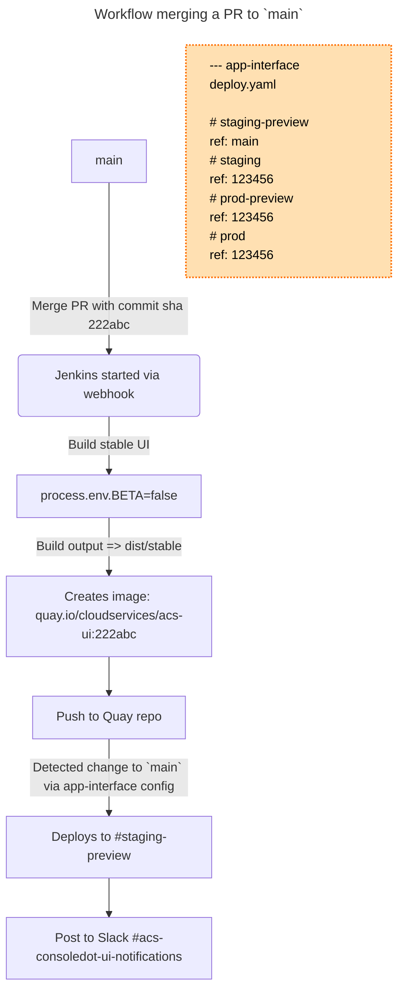
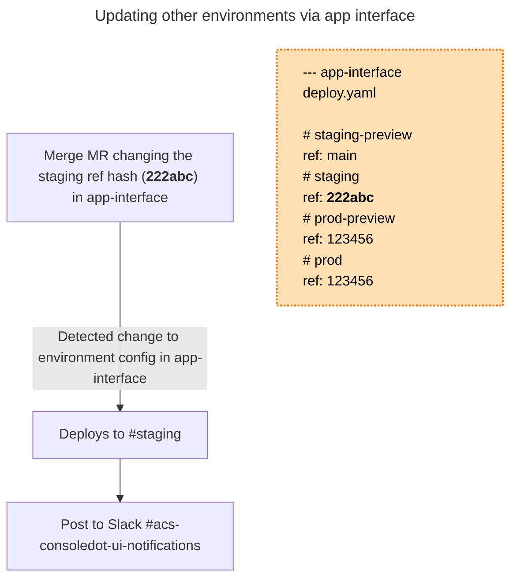

# acs-ui

Advanced Cluster Security application for the consoledot platform that includes Patternfly 4 and shared Red Hat cloud service frontend components.

## Initial access setup

In order to access the <https://[env>].foo.redhat.com URL in your browser, you have to add entries to your `/etc/hosts` file. This is a **one-time** setup that has to be done only once (unless you modify hosts) on each machine.

To setup the hosts file run following command:

```bash
sudo npm run patch:hosts
```

If this command throws an error you can manually add the following to `/etc/hosts`:

```bash
127.0.0.1       prod.foo.redhat.com
127.0.0.1       stage.foo.redhat.com
```

If you want to access stage.foo, even though staging is not utilized, you have to follow [this guide](https://source.redhat.com/groups/public/customer-platform-devops/digital_experience_operations_dxp_ops_wiki/using_squid_proxy_to_access_akamai_preprod_domains_over_vpn) and set up the Red Hat Squid proxy. Depending on what browser you use, choosing either Firefox, Chrome, or Safari would be a good choice.

## Getting started

1. `npm install`

2. `npm run start`

3. select `prod` -> `beta`

4. Open browser to the URL listed in the terminal output

**Note:** You will need to register for a personal Red Hat Account if you haven't already. You'll need it in order to log into the UI

**Note:** The redhat-cloud-services packages used to integrate with the Console require either **Docker** or **Podman** to be installed

### Testing

`npm run verify` will run `npm run lint` (eslint) and `npm test` (Jest)

## Definitions

- `prod` - Production
- `preview` - Some UI features or even services are in a pre-release or preview state. Usually only in stage.
- `stable` - Non-preview stable version

## Deploying

> Note that the majority of the following information was derived from the original frontend container migration document [here](https://consoledot.pages.redhat.com/docs/dev/containerized-frontends/overview/overview.html) (VPN)

The following environments are available for deployment:

- Staging: https://console.dev.redhat.com/application-services/acs/overview or https://console.dev.redhat.com/openshift/acs/overview
- Production: https://console.redhat.com/application-services/acs/overview or https://console.redhat.com/openshift/acs/overview

Note: The `Preview` environment can be turned on/off by the toggle in the UI, but the URL will remain the same.

### Containerized builds

Upon a commit being merged to `main`, a stable build of the app will be automatically built via Jenkins. This build will be included into a single image in the `/stable/` subdirectory under the `/dist/`
directory on the image's file system.

A build will also be initialized when a PR is opened against the acs-ui repository, and pushed to Quay with a tag in the format of `pr-<PR#>-<sha>`. These images will only be available for testing for 3 days.

Note that no commits other than merges to `main` will be automatically deployed to any environment.

You can troubleshoot image builds by visiting [Jenkins](https://ci.ext.devshift.net/blue/organizations/jenkins/pipelines/?search=acs-ui).

Images will be pushed to the cloudservices organization on [Quay](https://quay.io/repository/cloudservices/acs-ui?tab=info).

### Deploying to an environment

New images built from the `main` branch will be automatically deployed to **staging preview**, as configured in the `resourceTemplates`
section of our deploy configuration in [app-interface](https://gitlab.cee.redhat.com/service/app-interface/-/blob/master/data/services/insights/acs-ui/deploy.yml?ref_type=heads#L29).



Images for **staging**, **production-preview**, and **production** will only be deployed when a MR is made to the above app-interface deploy.yaml that updates
the image ref for a given environment. Note again that image refs must match a commit on the `main` branch and should have an image with a tag matching the commit sha in Quay.

New deployments to any of the four environments will be announced on Slack channel [#acs-consoledot-ui-notifications](https://redhat.enterprise.slack.com/archives/C06T3LAN9KJ).


