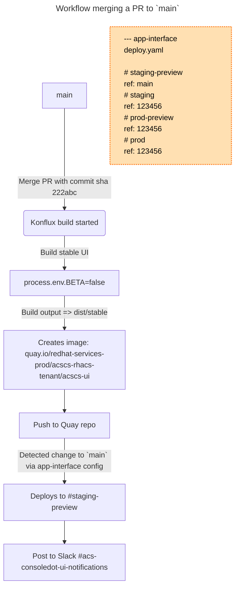

# acs-ui

Advanced Cluster Security application for the consoledot platform that includes Patternfly 4 and shared Red Hat cloud service frontend components.

## Initial access setup

In order to access the <https://[env>].foo.redhat.com URL in your browser, you have to add entries to your `/etc/hosts` file. This is a **one-time** setup that has to be done only once (unless you modify hosts) on each machine.

To setup the hosts file run following command:

```bash
sudo npm run patch:hosts
```

If this command throws an error you can manually add the following to `/etc/hosts`:

```bash
127.0.0.1       prod.foo.redhat.com
127.0.0.1       stage.foo.redhat.com
```

If you want to access stage.foo, even though staging is not utilized, you have to follow [this guide](https://source.redhat.com/groups/public/customer-platform-devops/digital_experience_operations_dxp_ops_wiki/using_squid_proxy_to_access_akamai_preprod_domains_over_vpn) and set up the Red Hat Squid proxy. Depending on what browser you use, choosing either Firefox, Chrome, or Safari would be a good choice.

## Getting started

1. `npm install`

2. `npm run start`

3. select `prod` -> `beta`

4. Open browser to the URL listed in the terminal output

**Note:** You will need to register for a personal Red Hat Account if you haven't already. You'll need it in order to log into the UI

**Note:** The redhat-cloud-services packages used to integrate with the Console require either **Docker** or **Podman** to be installed

### Testing

`npm run verify` will run `npm run lint` (eslint) and `npm test` (Jest)

## Definitions

- `prod` - Production
- `preview` - Some UI features or even services are in a pre-release or preview state. Usually only in stage.
- `stable` - Non-preview stable version

## Deploying

> Note that the majority of the following information was derived from the original frontend container migration document [here](https://consoledot.pages.redhat.com/docs/dev/containerized-frontends/overview/overview.html) (VPN)

The following environments are available for deployment:

- Staging: https://console.dev.redhat.com/application-services/acs/overview or https://console.dev.redhat.com/openshift/acs/overview
- Production: https://console.redhat.com/application-services/acs/overview or https://console.redhat.com/openshift/acs/overview

Note: The `Preview` environment can be turned on/off by the toggle in the UI, but the URL will remain the same.

### Containerized builds on Konflux

There are Konflux Tekton pipelines configured for every pull request and for every push to the `main` branch. 
These pipelines include a task to build a container using the generated Dockerfile from the [konflux-consoledot-frontend-build](https://github.com/RedHatInsights/konflux-consoledot-frontend-build) repository. 
The pipelines also incorporate various default Konflux checks and verification tasks. For more details, see:

- [Pull request Tekton pipeline](.tekton/acscs-ui-pull-request.yaml)
- [Push to main branch Tekton pipeline](.tekton/acscs-ui-push.yaml)

Every commit in the `main` branch is built and pushed to the `quay.io/redhat-services-prod/acscs-rhacs-tenant/acscs-ui` Quay repository. Each pull request builds an image and sends it to the `quay.io/redhat-user-workloads/acscs-rhacs-tenant/acscs-ui` Quay repository. Note that tags are prefixed with `on-pr-`.

Only commits merged into `main` will be automatically deployed to any environment.

#### Konflux Troubleshooting

Konflux CI steps are visible in the GitHub checks UI. If the Konflux CI fails, you can open the failing step to identify which task is broken and view logs for further investigation.

ACSCS UI Konflux integration is primarily configured in the following places:

- Konflux Tekton pipeline (see links above), defining CI tasks.
- [ACSCS UI Release Plan Admission](https://gitlab.cee.redhat.com/releng/konflux-release-data/-/blob/main/config/stone-prd-rh01.pg1f.p1/service/ReleasePlanAdmission/acscs-rhacs/acscs-ui.yaml), which configures successful image releases and specifies where to push them.
- [ACSCS UI Konflux application configuration](https://gitlab.cee.redhat.com/releng/konflux-release-data/-/tree/main/tenants-config/cluster/stone-prd-rh01/tenants/acscs-rhacs-tenant/acscs-ui).

You can ask for support in the `#konflux-users` Slack channel.

### Deploying to an environment

New images built from the `main` branch will be automatically deployed to **staging preview**, as configured in the `resourceTemplates`
section of our deploy configuration in [app-interface](https://gitlab.cee.redhat.com/service/app-interface/-/blob/master/data/services/insights/acs-ui/deploy.yml?ref_type=heads#L29).



Images for **staging**, **production-preview**, and **production** will only be deployed when a MR is made to the above app-interface deploy.yaml that updates
the image ref for a given environment. Note again that image refs must match a commit on the `main` branch and should have an image with a tag matching the commit sha in Quay.

New deployments to any of the four environments will be announced on Slack channel [#acs-consoledot-ui-notifications](https://redhat.enterprise.slack.com/archives/C06T3LAN9KJ).


